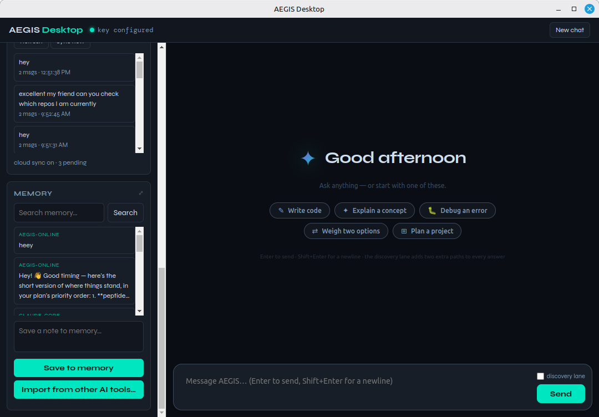

# AEGIS Desktop

A standalone Electron chat app over the [AEGIS](https://aegiscloud.org) API,
with an **agentic tool loop**: the model can read, write, and edit files,
list directories, glob, grep, run shell commands in a persistent session, and
delegate whole sub-tasks to subagents. It does **not** require Claude Code.



## Install

```bash
npm install -g aegis-desktop
aegis
```

The published package is [`aegis-desktop`](https://www.npmjs.com/package/aegis-desktop)
on npm; this repo is its source.

## Model classes

Pick any of four transports from the model-class picker, switchable
mid-conversation with context intact:

| Class | Transport | Key held in |
|---|---|---|
| **Aegis Cloud** | `aegiscloud.org` — one entry, **Nexus**; the pool auto-routes across whichever providers are live | main process |
| **Ollama** | local `ollama` daemon | no key needed |
| **Custom OpenAI-compatible** (LM Studio, OpenRouter, vLLM, …) | direct from the desktop app | main process — never sent to the renderer |
| **Anthropic-compatible** (Claude, or any Messages-format gateway) | direct from the desktop app | main process |

Get a free AEGIS key at **https://aegiscloud.org**, or use your own
Ollama/OpenAI-compatible/Anthropic-compatible endpoint — no AEGIS account
needed for those.

## Tools available to the model

| Tool | What it does |
|---|---|
| `readFile` · `writeFile` · `editFile` | File access scoped to the working directory |
| `listDir` · `glob` · `grep` | Navigate and search a tree |
| `exec` | Run commands in a persistent shell session |
| `task` | Delegate a self-contained sub-task to a subagent |

Before `exec`, `writeFile`, or `editFile` runs, a diff/approval card asks you
to confirm — approve once, approve for the rest of the conversation, or deny.
Flip **Settings → "Confirm before running tools"** off if you'd rather the
agent run mutating tool calls without asking; it's on by default.

Conversations persist locally and sync to AEGIS cloud memory via a pending
queue that flushes on each "Sync now" or heartbeat retry. The **remember**
button on any assistant reply pins that message to cross-machine memory —
queued locally if you're offline.

## Keyboard shortcuts

### In the main window

| Shortcut | Action |
|---|---|
| `Cmd/Ctrl+N` | New chat |
| `Cmd/Ctrl+K` | Open search (memory inspector) |
| `Cmd/Ctrl+S` | Save as… (export the open session as Markdown) |
| `Cmd/Ctrl+R` | Reload |
| `Cmd/Ctrl+Shift+I` | Toggle DevTools |
| `Enter` | Send the composer prompt |
| `Shift+Enter` | Newline in the composer |
| `Esc` | Close the memory inspector overlay |

### Global quick launcher

`Cmd/Ctrl+Shift+Space` (default, configurable in the sidebar's **Quick
Launcher** card) toggles a small, frameless, always-on-top prompt window near
your cursor — from anywhere on the desktop, even when AEGIS Desktop isn't the
focused app. It streams a one-shot answer over the same transport the main
window uses, with the agent's tool-calling loop turned off (no file/shell
access, no approval prompts) — just a fast question and an answer.

| Shortcut | Action |
|---|---|
| `Cmd/Ctrl+Shift+Space` (default, configurable) | Toggle the quick launcher |
| `Enter` | Ask the typed prompt |
| `Shift+Enter` | Newline in the prompt |
| `Cmd/Ctrl+Enter` | Add the current answer to the main window as a new chat turn |
| `Esc` | Close the quick launcher |
| *(click away)* | Also closes it — closing never steals focus from whatever window had it before |

**Packaged builds** (the installed app) always register the global shortcut.
**Dev runs** (`npm start` / `electron .`) do not, unless you turn on "enable
global shortcut" in the sidebar's Quick Launcher card — this keeps a local
dev session from silently grabbing a systemwide hotkey. If the configured
accelerator is already claimed by another application, registration fails
gracefully: a warning is logged to the main process console and the
Quick Launcher card shows the reason instead of the app crashing or hanging.

## Deep links

The app registers an `aegis://` protocol handler:

| Link | What it does |
|---|---|
| `aegis://open?session=<id>` | Resumes a saved session |
| `aegis://new?prompt=<text>` | Starts a fresh chat with that prompt pre-filled |

## Token usage display

Every assistant turn reports what it consumed and what it cost. The count is
the **whole turn**, not just the last model reply — a single turn issues one
billed provider call per tool round, so the engine sums usage across every
round (including the truncation retry, the synthesis re-dispatch, and any
subagents) and the footer shows that total.

Counter normalisation happens in `renderer/usage.js` (the display mapping,
unit-tested in the upstream monorepo) and in the vendored transport, because
the wire spellings differ per provider:

| Provider class | What the wire reports |
|---|---|
| Aegis Cloud (Nexus) | OpenAI-style SSE. The stream only carries `usage` when the request asks for it (`stream_options.include_usage`), so the client sets that on streaming calls and retries without it — still streamed — if a server rejects the flag. |
| OpenAI-compatible | `prompt_tokens` / `completion_tokens` / `total_tokens` |
| Anthropic-compatible | Anthropic splits usage across two SSE events: `message_start` carries the input side, `message_delta` carries a cumulative output side and **no** input side. Both halves are merged, and cache-read/creation tokens are folded into the prompt total so a cached turn doesn't read as free. |

If a provider genuinely returns no usage, the row stays blank rather than
showing a misleading `0 tokens`.

## Run from source

```bash
git clone https://github.com/aegiscloud/aegiscode-desktop.git
cd aegiscode-desktop
npm install
npm start
```

## Build a distributable

```bash
npm run dist        # packaged app (AppImage / MSI+NSIS / dmg)
npm run dist:dir    # unpacked dir, for quick testing
```

Targets: Windows (NSIS `.exe` + `.msi`), macOS (`.dmg`), Linux (`AppImage`) —
see `electron-builder.yml`. Artifacts are currently **unsigned** (Windows
Authenticode via SignPath Foundation is pending — see `SIGNING.md`).

## Checks

```bash
npm run check   # node --check every main-process + renderer file
```

## Structure

```
main.js              Electron main process — window + IPC shell only
preload.js           Context-isolated IPC bridge exposed to the renderer
renderer/            UI (vanilla JS, no framework)
lib/local/           Model classes, providers, agentic tool loop, prompt
lib/sync/            Local session/memory persistence + sync queue
vendor/aegis.js      The AEGIS transport client (thin — no engine logic)
bin/aegis.js         `aegis` CLI entry point for the global npm install
```

`vendor/aegis.js` is a vendored copy of the shared transport client also used
by the [AEGIS Code](https://github.com/aegisinfo/aegiscode-plugin) Claude Code
plugin and CLI — same wire format, no engine/routing/tier logic on this side
of the network boundary. This repo is a `git subtree split` of that
monorepo's `desktop/` — architecture notes, tests, and the Claude Code plugin
surface live there.

## License

MIT
